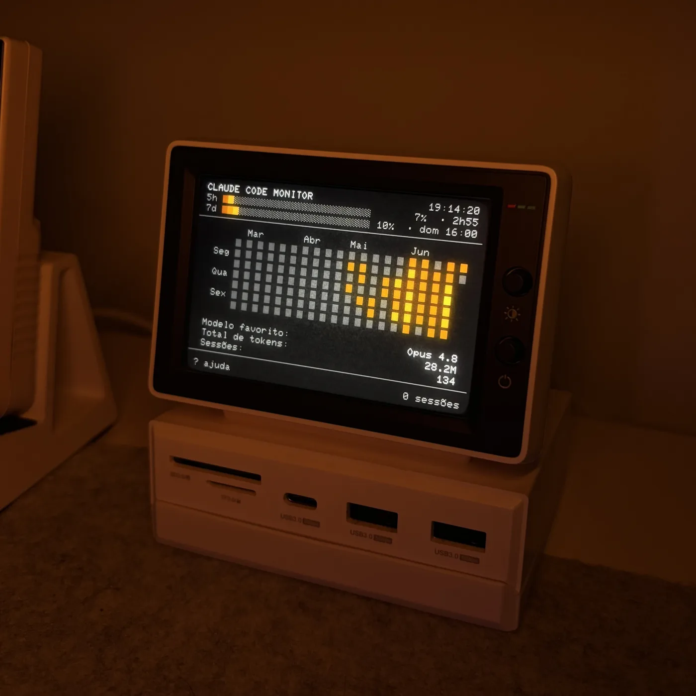
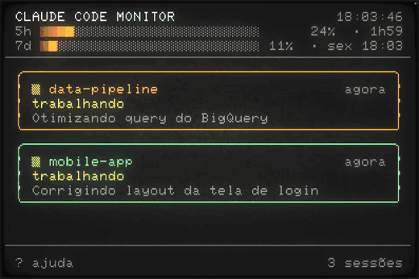
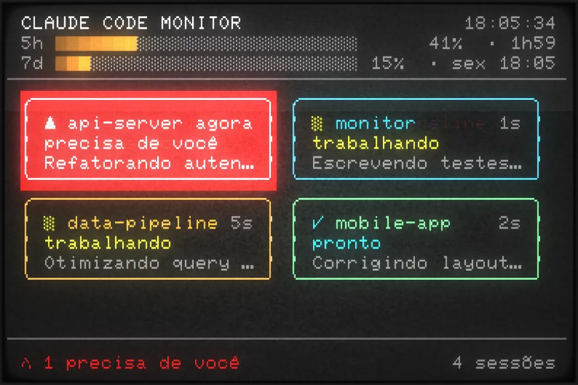
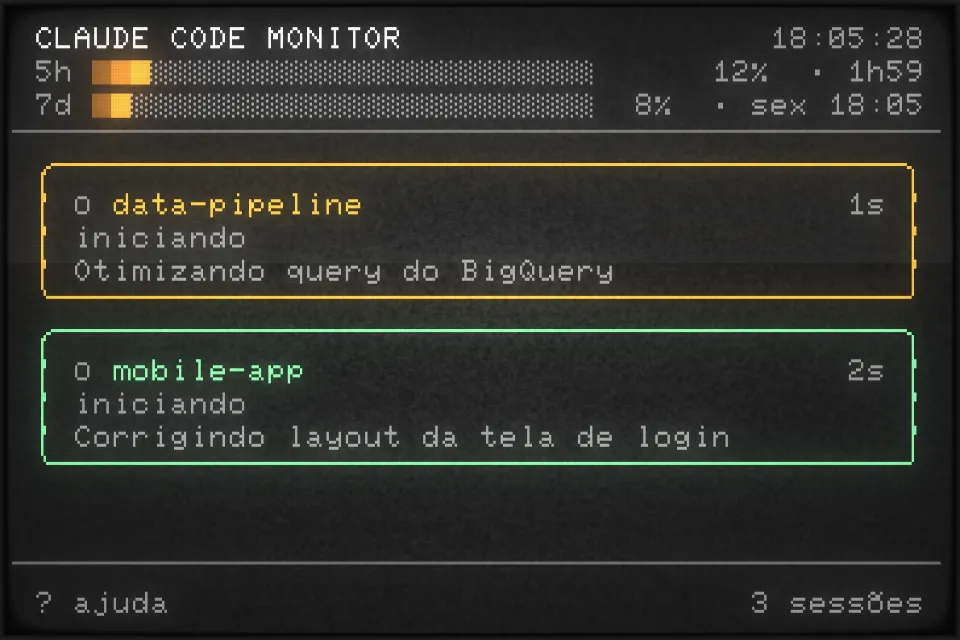
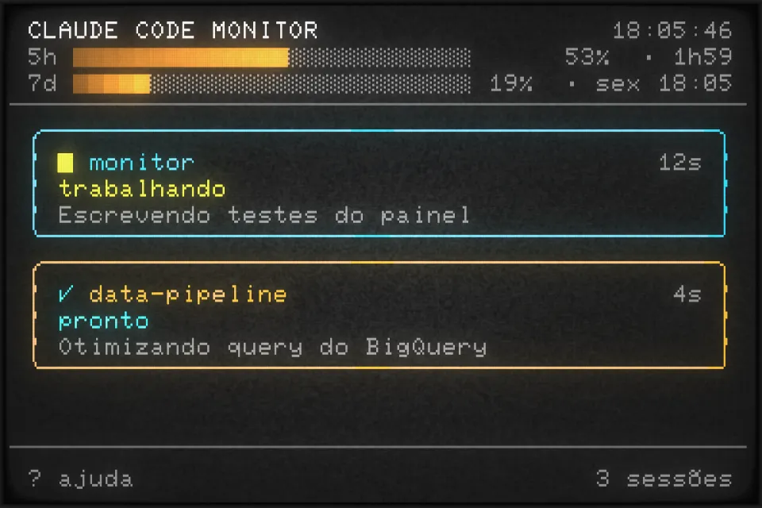
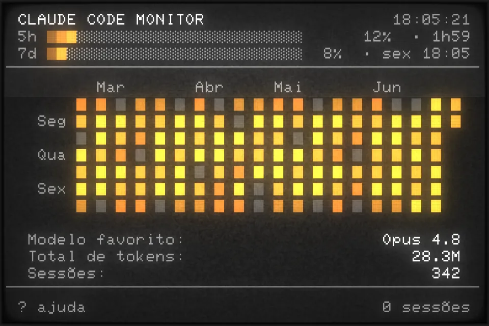

# agent-monitor

> A tiny status panel for a second screen — glance over and see your background AI agents while you stay heads-down on your day-to-day work.

<div align="center">
  <table>
    <tr>
      <td></td>
      <td><a href="https://github.com/andreyneto/agent-monitor/raw/main/assets/demo.webm"></a></td>
    </tr>
  </table>
</div>

<p align="center"><em>▶ <a href="https://github.com/andreyneto/agent-monitor/raw/main/assets/demo.webm">Watch the full demo (webm)</a></em></p>

## Why

`agent-monitor` (binary: **`mon`**) is a terminal dashboard I run on the little
[Hagibis USB-C hub with a built-in second screen](https://hagibis.com/products/usb-c-hub-with-second-screen-288)
sitting on my desk. Claude Code (and any other agent) fires **hooks** as sessions
start, work, need me, or finish. The panel reads those events live and — the
moment a session needs my attention — **beeps and flashes the card red**, so I
can stay focused in my main editor and just look over when the small screen
lights up.

Personal project, tuned for that specific screen (a
[cool-retro-terminal](https://github.com/Swordfish90/cool-retro-terminal) at a
**48×18** baseline). The panel UI is in Portuguese.

## Screenshots

| Needs attention (beep + red flash) | Sessions working |
|---|---|
|  |  |
| **Winding down** | **Usage overview (idle)** |
|  |  |

## How to run

Requires Go 1.26+ and macOS (uses `afplay` for the alarm sound).

```bash
# build from source
git clone https://github.com/andreyneto/agent-monitor.git
cd agent-monitor
go build -o mon ./cmd/mon

# …or install onto your PATH
go install github.com/andreyneto/agent-monitor/cmd/mon@latest
```

Wire up the Claude Code hooks (writes to `~/.claude/settings.json`, with a
backup), then restart your Claude Code sessions:

```bash
./mon install
```

Open the panel on your second screen:

```bash
mon         # open the panel
mon test    # inject sample sessions to see it working
mon help    # help
```

## Documentation

Full reference — how it works, keys, panel features, configuration, environment,
account quota, and pushing events from other tools — in
**[docs/DETAILS.md](docs/DETAILS.md)**.
